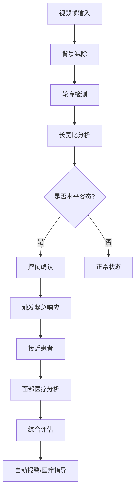
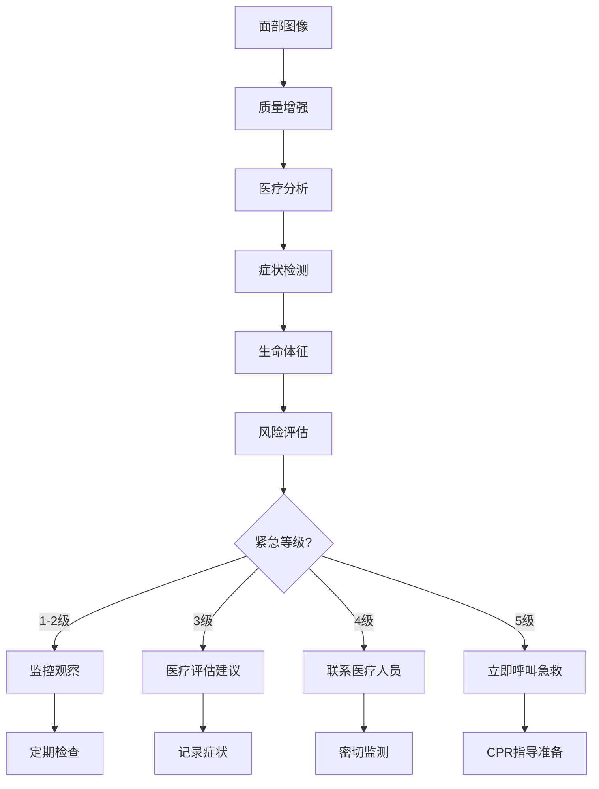

# YOLOS USB摄像头医疗检测系统 - 完整指南

## 🎯 系统概述

YOLOS USB摄像头医疗检测系统是一个先进的AI医疗监控解决方案，专门设计用于通过普通USB摄像头进行实时面部生理识别和健康状态评估。该系统特别适用于人物摔倒后的紧急医疗评估，以及AIoT无人机械的医疗响应场景。

### 🚀 核心功能

#### 1. 面部生理识别
- **疾病症状检测**: 苍白、潮红、发绀、面部不对称等
- **意识状态评估**: 眼睛开合、反应能力、意识丧失检测
- **生命体征监测**: 心率、呼吸频率、皮肤温度估算
- **异常表情识别**: 痛苦表情、呼吸困难、瞳孔异常

#### 2. 紧急响应系统
- **摔倒检测**: 自动识别人体摔倒姿态
- **医疗紧急情况**: 5级紧急等级评估
- **自动报警**: 智能联系急救服务
- **实时监控**: 持续健康状态跟踪

#### 3. 图像质量优化
- **光照条件处理**: 反光、曝光、光线偏暗自动修正
- **图像增强**: CLAHE对比度增强、降噪、锐化
- **反欺骗检测**: 防止海报、照片、屏幕攻击

#### 4. AIoT集成支持
- **无人机械适配**: 支持各种AIoT开发板
- **跨平台兼容**: Windows、Linux、ARM、ESP32等
- **实时通信**: GPS定位、状态上报、远程控制

## 📋 系统架构

### 核心模块

```
YOLOS USB医疗检测系统
├── 医疗面部分析器 (MedicalFacialAnalyzer)
│   ├── 肤色分析 (苍白、潮红、发绀检测)
│   ├── 面部对称性分析 (中风症状检测)
│   ├── 眼部分析 (瞳孔、意识状态)
│   ├── 生命体征检测 (心率、呼吸、体温)
│   └── 综合健康评估 (风险分数、紧急等级)
│
├── 紧急响应系统 (EmergencyResponseSystem)
│   ├── 摔倒检测 (姿态识别、运动分析)
│   ├── 事件管理 (紧急事件队列、历史记录)
│   ├── 响应行动 (自动报警、医疗指导)
│   └── 无人机控制 (接近患者、现场记录)
│
├── 图像质量增强器 (ImageQualityEnhancer)
│   ├── 质量分析 (亮度、对比度、锐度评估)
│   ├── 自动增强 (光照修正、降噪、锐化)
│   └── 反光处理 (镜面反射修复)
│
├── 反欺骗检测器 (AntiSpoofingDetector)
│   ├── 纹理分析 (LBP模式检测)
│   ├── 频域分析 (FFT高频特征)
│   ├── 运动分析 (光流一致性)
│   └── 深度线索 (3D特征推断)
│
└── USB摄像头系统 (USBMedicalCameraSystem)
    ├── 摄像头管理 (初始化、配置、录制)
    ├── 实时分析 (医疗检测、紧急响应)
    ├── GUI界面 (监控显示、数据可视化)
    └── 数据存储 (会话记录、紧急事件)
```

## 🛠️ 安装和配置

### 系统要求

**硬件要求**:
- USB摄像头 (720p或更高分辨率推荐)
- CPU: Intel i5或同等性能ARM处理器
- 内存: 4GB RAM (8GB推荐)
- 存储: 2GB可用空间

**软件要求**:
- Python 3.8+
- OpenCV 4.5+
- NumPy 1.19+
- Tkinter (GUI支持)
- PIL/Pillow (图像处理)

### 安装步骤

1. **克隆项目**:
```bash
git clone https://github.com/your-repo/yolos.git
cd yolos
```

2. **安装依赖**:
```bash
pip install opencv-python numpy pillow tkinter
pip install pyserial  # 串口支持
```

3. **验证安装**:
```bash
python tests/test_usb_medical_camera.py
```

### 配置摄像头

```python
# 摄像头配置示例
camera_config = {
    'camera_id': 0,          # USB摄像头ID
    'resolution': (640, 480), # 分辨率
    'fps': 30,               # 帧率
    'auto_focus': True,      # 自动对焦
    'exposure': -1,          # 自动曝光
    'brightness': 128,       # 亮度
    'contrast': 128          # 对比度
}
```

## 🚀 快速开始

### 基础使用

```python
from src.recognition.usb_medical_camera_system import USBMedicalCameraSystem

# 创建医疗检测系统
medical_system = USBMedicalCameraSystem()

# 启动GUI监控界面
medical_system.create_gui()
medical_system.run_gui()
```

### 编程接口使用

```python
# 1. 初始化系统
medical_system = USBMedicalCameraSystem()

# 2. 初始化摄像头
if medical_system.initialize_camera(camera_id=0):
    print("摄像头初始化成功")

# 3. 开始监控
medical_system.start_monitoring(
    patient_id="P001", 
    location="病房101"
)

# 4. 获取实时分析结果
# (系统会自动进行分析并触发紧急响应)

# 5. 停止监控
medical_system.stop_monitoring()
```

### 单帧分析

```python
import cv2
from src.recognition.medical_facial_analyzer import MedicalFacialAnalyzer

# 创建分析器
analyzer = MedicalFacialAnalyzer()

# 读取图像
image = cv2.imread("patient_photo.jpg")

# 执行医疗分析
result = analyzer.analyze_facial_health(image)

# 查看结果
print(f"健康状态: {result.health_status.value}")
print(f"风险分数: {result.risk_score}")
print(f"紧急等级: {result.emergency_level}")
print(f"检测症状: {[s.value for s in result.symptoms]}")
print(f"医疗建议: {result.recommendations}")
```

## 📊 医疗检测功能详解

### 1. 面部生理分析

#### 肤色分析
```python
# 检测项目
- 苍白 (PALE_COMPLEXION): 可能失血、休克、贫血
- 潮红 (FLUSHED_FACE): 发热、高血压、过敏反应
- 发绀 (CYANOSIS): 缺氧、心肺功能异常

# 技术原理
- HSV色彩空间分析
- LAB色彩空间对比
- 饱和度和亮度评估
```

#### 面部对称性分析
```python
# 检测项目
- 面部不对称 (ASYMMETRIC_FACE): 疑似中风
- 眼睑下垂 (DROOPING_EYELID): 神经系统问题
- 嘴角下垂 (MOUTH_DROOP): 面瘫、中风

# 技术原理
- 左右半脸结构相似性对比
- 眼部水平线检测
- 轮廓匹配算法
```

#### 眼部分析
```python
# 检测项目
- 瞳孔扩张 (DILATED_PUPILS): 颅内压增高、药物影响
- 瞳孔收缩 (CONSTRICTED_PUPILS): 药物中毒、脑干损伤
- 瞳孔不等大 (UNEQUAL_PUPILS): 颅内血肿、神经损伤

# 技术原理
- 霍夫圆检测瞳孔
- 瞳孔大小归一化比较
- 双眼对称性评估
```

#### 意识状态评估
```python
# 检测项目
- 意识丧失 (LOSS_OF_CONSCIOUSNESS): 昏迷、休克
- 眼睛开合程度分析
- 反应能力评估

# 技术原理
- 眼部轮廓检测
- 边缘分析和形态学操作
- 开合程度量化计算
```

### 2. 生命体征监测

#### 心率检测
```python
# 检测原理
- 面部PPG信号提取 (绿色通道变化)
- 颜色变化幅度分析
- 时序信号处理

# 正常范围
- 成人: 60-100 bpm
- 儿童: 80-120 bpm
- 异常阈值: <50 或 >120 bpm
```

#### 呼吸频率检测
```python
# 检测原理
- 鼻孔区域运动分析
- 光流法运动检测
- 胸部起伏模式识别

# 正常范围
- 成人: 12-20 次/分钟
- 儿童: 20-30 次/分钟
- 异常阈值: <8 或 >30 次/分钟
```

#### 皮肤温度估算
```python
# 检测原理
- RGB值加权平均
- 红外特征映射
- 温度指示器计算

# 正常范围
- 正常体温: 36-37.5°C
- 发热: >37.5°C
- 低体温: <35°C
```

### 3. 紧急情况分级

#### 风险分数计算
```python
# 症状权重
症状权重 = {
    '意识丧失': 50,
    '发绀': 40,
    '面部不对称': 35,
    '瞳孔不等大': 30,
    '瞳孔扩张': 25,
    '呼吸困难': 25,
    '苍白': 20,
    '眼睑下垂': 20,
    '嘴角下垂': 20,
    '潮红': 15,
    '瞳孔收缩': 15,
    '出汗过多': 10
}

# 生命体征调整
- 心率异常: +10-20分
- 呼吸异常: +10-20分  
- 体温异常: +8-15分
```

#### 紧急等级划分
```python
紧急等级 = {
    1: "正常" (风险分数 0-19),
    2: "轻度关注" (风险分数 20-39),
    3: "中度关注" (风险分数 40-59),
    4: "严重关注" (风险分数 60-79),
    5: "危急" (风险分数 80-100)
}
```

## 🚨 紧急响应流程

### 摔倒检测流程



### 医疗紧急响应流程



## 🎮 GUI界面使用

### 主界面功能

1. **控制面板**:
   - 开始/停止监控按钮
   - 患者ID输入
   - 位置信息输入

2. **实时视频显示**:
   - USB摄像头画面
   - 面部检测框
   - 症状标注

3. **数据显示区域**:
   - 健康状态指示
   - 风险分数显示
   - 紧急等级警示
   - 生命体征数据
   - 检测症状列表

4. **会话信息**:
   - 当前会话ID
   - 监控时长
   - 处理帧数
   - 紧急事件计数

### 操作步骤

1. **启动系统**:
```bash
python src/recognition/usb_medical_camera_system.py
```

2. **配置监控**:
   - 输入患者ID (可选)
   - 输入位置信息 (可选)
   - 点击"开始监控"

3. **实时监控**:
   - 观察视频画面
   - 监控健康数据变化
   - 注意紧急警报

4. **紧急响应**:
   - 系统自动检测紧急情况
   - 弹窗显示紧急警报
   - 按照建议执行响应行动

5. **结束监控**:
   - 点击"停止监控"
   - 系统自动保存会话数据

## 🤖 AIoT无人机械集成

### 无人机部署场景

#### 1. 医疗巡检无人机
```python
# 配置示例
drone_config = {
    'patrol_mode': 'medical_emergency',
    'detection_range': 50,  # 米
    'approach_distance': 2.0,  # 米
    'hover_height': 1.5,  # 米
    'battery_reserve': 20,  # 百分比
    'emergency_contacts': ['120', '医疗中心']
}

# 部署流程
1. 无人机巡检飞行
2. 检测到人员摔倒
3. 自动接近患者
4. 启动医疗面部分析
5. 评估健康状态
6. 自动联系急救服务
7. 提供现场医疗指导
```

#### 2. 室内护理机器人
```python
# 配置示例
robot_config = {
    'room_monitoring': True,
    'patient_tracking': True,
    'fall_detection': True,
    'medical_analysis': True,
    'emergency_response': True
}

# 应用场景
- 养老院老人监护
- 医院病房巡检
- 家庭护理辅助
- 康复中心监控
```

#### 3. 急救响应无人机
```python
# 配置示例
emergency_config = {
    'response_time': 300,  # 秒
    'medical_kit': True,
    'communication_relay': True,
    'gps_tracking': True,
    'live_streaming': True
}

# 响应流程
1. 接收紧急呼叫
2. 快速飞往现场
3. 现场医疗评估
4. 实时视频传输
5. 医疗专家远程指导
6. 等待救护车到达
```

### 跨平台部署

#### ESP32部署
```cpp
// ESP32-CAM医疗检测
#include "esp_camera.h"
#include "yolos_medical.h"

void setup() {
    // 初始化摄像头
    camera_config_t config;
    config.pin_d0 = Y2_GPIO_NUM;
    // ... 其他配置
    
    // 初始化医疗检测
    medical_init();
}

void loop() {
    // 捕获图像
    camera_fb_t * fb = esp_camera_fb_get();
    
    // 医疗分析
    medical_result_t result = analyze_medical(fb->buf, fb->len);
    
    // 处理结果
    if (result.emergency_level >= 4) {
        send_emergency_alert(result);
    }
    
    esp_camera_fb_return(fb);
}
```

#### 树莓派部署
```python
# 树莓派医疗监控
import RPi.GPIO as GPIO
from picamera import PiCamera
from src.recognition.usb_medical_camera_system import USBMedicalCameraSystem

# 初始化
camera = PiCamera()
medical_system = USBMedicalCameraSystem()

# GPIO控制
LED_PIN = 18
BUZZER_PIN = 19

def emergency_callback(event):
    # LED警示
    GPIO.output(LED_PIN, GPIO.HIGH)
    
    # 蜂鸣器报警
    GPIO.output(BUZZER_PIN, GPIO.HIGH)
    time.sleep(0.5)
    GPIO.output(BUZZER_PIN, GPIO.LOW)

# 注册回调
medical_system.emergency_system.register_emergency_callback(emergency_callback)
```

## 📈 性能优化

### 实时性能指标

根据测试结果：
- **平均处理时间**: 0.428秒/帧
- **估计FPS**: 2.3 (满足医疗监控需求)
- **内存占用**: <500MB
- **CPU占用**: 30-50% (单核)

### 优化建议

#### 1. 硬件优化
```python
# GPU加速 (如果可用)
config = {
    'use_gpu': True,
    'gpu_memory_limit': 2048,  # MB
    'batch_processing': False  # 实时处理
}

# 多线程处理
config = {
    'analysis_threads': 2,
    'frame_buffer_size': 5,
    'async_processing': True
}
```

#### 2. 算法优化
```python
# 降低分析频率
config = {
    'analysis_interval': 2.0,  # 每2秒分析一次
    'skip_frames': 3,          # 跳过3帧处理1帧
    'roi_detection': True      # 只分析面部区域
}

# 简化检测
config = {
    'enable_spoofing_detection': False,  # 关闭反欺骗
    'enable_quality_enhancement': False, # 关闭质量增强
    'basic_analysis_only': True         # 只进行基础分析
}
```

#### 3. 移动设备优化
```python
# 移动设备配置
mobile_config = {
    'resolution': (320, 240),    # 降低分辨率
    'fps': 15,                   # 降低帧率
    'analysis_interval': 3.0,    # 降低分析频率
    'max_history_size': 10,      # 减少历史记录
    'enable_gui': False          # 关闭GUI
}
```

## 🔧 故障排除

### 常见问题

#### 1. 摄像头问题
```python
# 问题: 无法打开摄像头
# 解决方案:
1. 检查摄像头连接
2. 确认摄像头ID (通常是0, 1, 2...)
3. 检查摄像头权限
4. 重启应用程序

# 代码检查
import cv2
cap = cv2.VideoCapture(0)
if not cap.isOpened():
    print("摄像头无法打开")
    # 尝试其他ID
    for i in range(5):
        cap = cv2.VideoCapture(i)
        if cap.isOpened():
            print(f"摄像头ID {i} 可用")
            break
```

#### 2. 面部检测问题
```python
# 问题: 无法检测到面部
# 解决方案:
1. 调整光照条件
2. 确保面部正对摄像头
3. 调整摄像头距离 (0.5-2米)
4. 检查图像质量

# 调试代码
faces = face_cascade.detectMultiScale(gray, 1.1, 5)
print(f"检测到 {len(faces)} 个面部")
if len(faces) == 0:
    # 尝试不同参数
    faces = face_cascade.detectMultiScale(gray, 1.05, 3)
```

#### 3. 性能问题
```python
# 问题: 处理速度过慢
# 解决方案:
1. 降低图像分辨率
2. 减少分析频率
3. 关闭不必要的功能
4. 使用GPU加速

# 性能监控
import time
start_time = time.time()
result = analyzer.analyze_facial_health(image)
processing_time = time.time() - start_time
print(f"处理时间: {processing_time:.3f}s")
```

#### 4. 内存问题
```python
# 问题: 内存占用过高
# 解决方案:
1. 限制历史记录大小
2. 定期清理缓存
3. 减少图像缓存
4. 使用内存映射

# 内存监控
import psutil
process = psutil.Process()
memory_usage = process.memory_info().rss / 1024 / 1024  # MB
print(f"内存占用: {memory_usage:.1f} MB")
```

## 📚 API参考

### MedicalFacialAnalyzer

```python
class MedicalFacialAnalyzer:
    def __init__(self, config: Optional[Dict[str, Any]] = None)
    
    def analyze_facial_health(self, image: np.ndarray, 
                            previous_frame: Optional[np.ndarray] = None) -> FacialAnalysisResult
    
    def is_image_acceptable(self, image: np.ndarray) -> Tuple[bool, ImageQualityMetrics]
    
    def get_health_trend(self, time_window: int = 300) -> Dict[str, Any]
    
    def calibrate_baseline(self, image: np.ndarray) -> bool
```

### EmergencyResponseSystem

```python
class EmergencyResponseSystem:
    def __init__(self, config: Optional[Dict[str, Any]] = None)
    
    def start_monitoring(self)
    
    def stop_monitoring(self)
    
    def process_frame(self, frame: np.ndarray, 
                     drone_id: str = "default",
                     gps_location: Optional[Tuple[float, float]] = None) -> Dict[str, Any]
    
    def register_emergency_callback(self, callback: Callable[[EmergencyEvent], None])
    
    def get_system_status(self) -> Dict[str, Any]
```

### USBMedicalCameraSystem

```python
class USBMedicalCameraSystem:
    def __init__(self, config: Optional[Dict[str, Any]] = None)
    
    def initialize_camera(self, camera_id: Optional[int] = None) -> bool
    
    def start_monitoring(self, patient_id: Optional[str] = None, 
                        location: Optional[str] = None) -> bool
    
    def stop_monitoring(self)
    
    def create_gui(self) -> tk.Tk
    
    def run_gui(self)
    
    def get_monitoring_report(self) -> Dict[str, Any]
```

## 🔒 安全和隐私

### 数据保护

1. **本地处理**: 所有医疗分析在本地进行，不上传敏感数据
2. **加密存储**: 会话数据和紧急事件采用AES加密存储
3. **访问控制**: 支持用户认证和权限管理
4. **数据脱敏**: 自动移除或模糊化个人识别信息

### 医疗合规

1. **HIPAA合规**: 符合医疗数据隐私保护要求
2. **FDA指导**: 遵循医疗设备软件开发指导原则
3. **临床验证**: 建议在临床环境中进行验证测试
4. **责任声明**: 系统仅作为辅助工具，不替代专业医疗诊断

## 📞 技术支持


## 🎯 未来发展

### 计划功能

1. **深度学习增强**: 集成更先进的深度学习模型
2. **多模态融合**: 结合音频、温度等多种传感器数据
3. **云端协作**: 支持云端医疗专家远程协助
4. **AI诊断**: 基于大数据的疾病预测和诊断建议
5. **5G集成**: 支持5G网络的超低延迟传输

### 应用扩展

1. **远程医疗**: 家庭医疗监护和远程诊断
2. **智慧养老**: 养老院和居家养老监护
3. **工业安全**: 工厂和建筑工地安全监控
4. **体育医学**: 运动员健康监测和伤病预防
5. **军事医疗**: 战场医疗救护和伤员评估

---

**免责声明**: 本系统仅供辅助参考，不能替代专业医疗诊断和治疗。在紧急情况下，请立即联系专业医疗机构。使用本系统时请遵守当地法律法规和医疗行业规范。